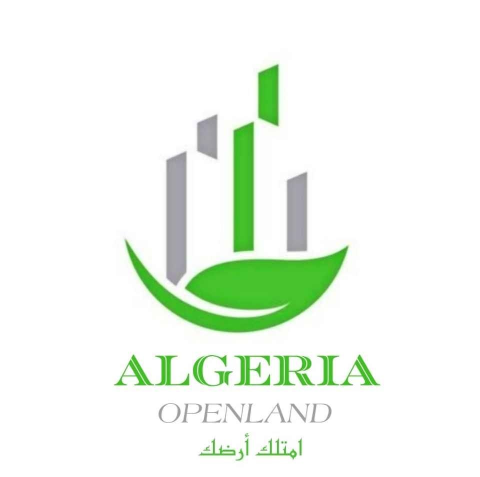

# 🌾 OpenLand - منصة الأراضي الزراعية

<div align="center">



**أول منصة رقمية جزائرية للأراضي الزراعية**

بيع • كراء • استثمار

[](https://nextjs.org/)
[](https://nodejs.org/)
[](https://www.typescriptlang.org/)
[](https://tailwindcss.com/)

</div>

---

## 📖 نبذة عن المشروع

OpenLand هي منصة رقمية متكاملة تهدف إلى تسهيل عمليات البيع والكراء والاستثمار في الأراضي الزراعية الجزائرية. توفر المنصة واجهة سهلة الاستخدام باللغة العربية مع دعم كامل للـ RTL.

### أنواع الأراضي المدعومة:
- 🏛️ **أراضي الدولة** (عقود الامتياز)
- 🏠 **أراضي الخواص** (الأفراد)
- 🕌 **أراضي وقفية**

---

## ✨ المميزات

- 🎨 تصميم عصري بأسلوب "Agri-Tech"
- 🌍 دعم كامل للغة العربية (RTL)
- 🗺️ خرائط تفاعلية مع Leaflet
- 🔍 بحث متقدم مع فلاتر متعددة
- 📱 تصميم متجاوب لجميع الأجهزة
- 🔐 نظام مصادقة آمن
- 📊 لوحة تحكم للبائعين والمشرفين
- 🖼️ معرض صور تفاعلي للعقارات

---

## 🛠️ التقنيات المستخدمة

### Frontend
| التقنية | الوصف |
|---------|-------|
| Next.js 16 | إطار عمل React |
| TypeScript | لغة البرمجة |
| Tailwind CSS | تنسيق CSS |
| Framer Motion | الرسوم المتحركة |
| Leaflet | الخرائط التفاعلية |
| React Query | إدارة الحالة |

### Backend
| التقنية | الوصف |
|---------|-------|
| Node.js | بيئة التشغيل |
| Express.js | إطار عمل الخادم |
| MongoDB | قاعدة البيانات |
| JWT | المصادقة |
| Multer | رفع الملفات |

---

## 🚀 التثبيت والتشغيل

### المتطلبات
- Node.js 18+
- MongoDB
- npm أو yarn

### خطوات التثبيت

1. **استنساخ المشروع**
```bash
git clone https://github.com/yourusername/openland.git
cd openland
```

2. **تثبيت الواجهة الأمامية**
```bash
cd frontend
npm install
```

3. **تثبيت الخادم**
```bash
cd ../backend
npm install
```

4. **إعداد المتغيرات البيئية**
```bash
# في مجلد backend، أنشئ ملف .env
MONGODB_URI=mongodb://localhost:27017/openland
JWT_SECRET=your_secret_key
PORT=5000
```

5. **تشغيل المشروع**
```bash
# تشغيل الخادم (من مجلد backend)
npm run dev

# تشغيل الواجهة (من مجلد frontend)
npm run dev
```

6. **فتح المتصفح**
```
http://localhost:3000
```

---

## 📁 هيكل المشروع

```
openland/
├── frontend/              # الواجهة الأمامية (Next.js)
│   ├── src/
│   │   ├── app/          # الصفحات
│   │   ├── components/   # المكونات
│   │   └── lib/          # الأدوات المساعدة
│   └── public/           # الملفات الثابتة
│
├── backend/               # الخادم (Express.js)
│   ├── src/
│   │   ├── controllers/  # وحدات التحكم
│   │   ├── models/       # نماذج البيانات
│   │   ├── routes/       # المسارات
│   │   └── middleware/   # الوسيطات
│   └── uploads/          # الملفات المرفوعة
│
└── README.md
```

---

## 📞 التواصل

- 📱 **الهاتف**: +213 542 557 621
- 📧 **البريد**: contact@openland.dz
- 📍 **العنوان**: خنشلة، خنشلة

---

## 📄 الرخصة

هذا المشروع محمي بحقوق الملكية. جميع الحقوق محفوظة © 2024 OpenLand

---

<div align="center">
صُنع بـ ❤️ في الجزائر 🇩🇿
</div>
